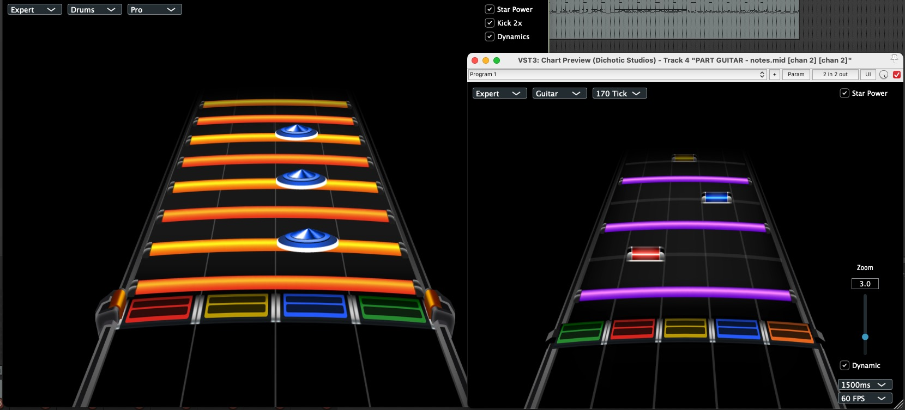

# Chart Preview
Chart Preview is a vst plugin designed for Reaper that visualizes midi notes as they'd appear in rhythm games like Clone Hero and YARG. Just throw the plugin on any track with midi notes and happy charting on **Windows**, **MacOS**, and **Linux**!

This plugin relies on the reaper-sdk for tight DAW integration allowing zero latency timeline scrubbing and a host of advanced midi features, BUT it can also work in any DAW with a reduced feature set if you prefer by relying on midi lookahead (which adds latency).

---

## What Can You Do?

### 🎸 **Guitar**
- See basic, chord, sustain, HOPO, open and tap notes
- Visual lanes for tremolos and trills
- Configurable auto-HOPO detection

### 🥁 **Drums**
- See snare, tom, cymbal and kick notes
- Toggleable 2x kick (double kick pedal) support
- Dynamics in the form of ghosts and accents
- Lanes for rolls and swells

### ✨ **General Features**
- Smooth rendering up to 120FPS
- Hit animations with visual feedback
- Adjustable playback speed
- Resizable, responsive interface
- Hide/show star power, dynamics, specific instruments
- **REAPER:** Zero-latency scrubbing with direct timeline access

---

## Installation

Download the latest version from [releases](https://github.com/noahbaxter/chart-preview/releases).

**macOS:**
- VST3: `~/Library/Audio/Plug-Ins/VST3/`
- AU: `~/Library/Audio/Plug-Ins/Components/`

**Windows:**
- Most DAWs: `C:\Program Files\Common Files\VST3\`
- REAPER: Check Preferences > Plug-ins > VST for custom paths

**Linux:**
- User: `~/.vst3/`
- System: `/usr/local/lib/vst3/` or `/usr/lib/vst3/`

After installing, restart your DAW to autoscan for the plugin.

---

## Quick Start

1. Add Chart Preview to any MIDI track
2. Select your instrument (Guitar or Drums)
3. Choose difficulty level (Easy/Medium/Hard/Expert)
4. Adjust playback speed to your liking
5. Play and chart!

**Pro tip:** Use REAPER for the best experience — direct timeline access with zero latency.

---

## Why Chart Preview?

- **Open source** — Fully built from the groundup as an MIT license
- **Cross-platform** — Works on Windows, macOS, and Linux
- **Accurate** — Properly renders all chart types and note modifiers
- **Fast** — Smooth high FPS rendering, optimized for real-time preview
- **Modern** — Built for current DAWs with 64bit VST3/AU support
- **REAPER integration** — Scrub and preview with zero latency

---

## Support

Have questions or found a bug? [Open an issue](https://github.com/noahbaxter/chart-preview/issues).

Want to support development? [Donate here](https://www.paypal.com/donate/?business=3P35P46JLEDJA&no_recurring=0&item_name=Support+the+ongoing+development+of+Chart+Preview.&currency_code=USD).

---

## License

Chart Preview is open source under the MIT license. Art assets are provided for build purposes only.

**Credits:** Huge thanks to Inventor211 for the custom art assets!
